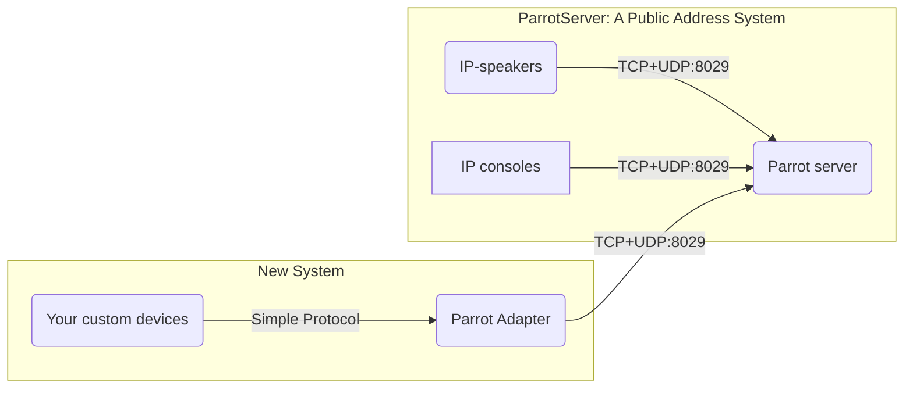

# Parrot-Adapter




`Parrot Adapter` is developed to make you custom devices to work as IP-speakers with the existing `Parrot Server`, with minimum effort on development.


The new `Simple Protocol` is designed very simple.


* Work on UDP-only. No TCP connection's needed.
* Space-efficient message format to reduce network bandwidth utilization.
* Easy to parse and serialize messages.

# Transport

The Parrot Adapter serves on UDP port.

# Protocol

## Message fields

Each UDP message sent or received is called a `Message`. Logically, a `Message` consists of the following fields

* Device Code (unsigned 32-bit integer)

  The unique identifier of client device. Client-to-server messages must contain this field. Messages sent by server may omit this field.

* Command (15-bit unsigned integer)

  A number that denotes the purpose of the message, just like the `URI` in `HTTP` protocol, which specify the resource a request accesses.

* Serial (15-bit unsigned integer)

  A number representing a transaction. When the server answers client requests, it send responses with the same serial number as that of the request.

* Payload (Binary byte array )

  Data containing parameters for the command, just like the request body or response body in `HTTP` protocol.

## Message Layout

The UDP message consists of the following fields

1. Magic Number (1)
   > The first byte is magic number, it's always 0xFF
2. Message Flags (1) - Several bitwise fields defined as follows

   | 7 (LSB)   | 6        | 5      | 4       | 3      | 2       | 1        | 0 (LSB)   |
   |-----------|----------|--------|---------|--------|---------|----------|-----------|
   | version1  | version2 | DEVICE | COMMAND | SERIAL | PAYLOAD | CHECKSUM | reserved  |
   | Must be 0 | Must be1 | Flag   | Flag    | Flag   | Flag    | Flag     | Must be 0 |

3. Device Code [4]

   > Exists only if 'Device Flag' is 1

4. Command - VarInt[2]

   > Exists only if 'command flag' is 1.

5. Serial - VarInt[2]

   > Exists only if 'serial flag' is 1

6. Payload Length - VarInt[2]

   > Exists only if 'payload flag' is 1

7. Payload Data - BINARY[N]

   > The length 'N' is denoted by 'Payload Length'

8. checksum  [2]

   > Exists only if 'checksum' flag is 1

## About VarInt

VarInt is the abbreviation or 'Variable length Integer'

It's efficient representing for data with smaller (and more common) values.

0 to 127 are represented with only 1 byte.
128 to 16383  are represented with 2 bytes.
Larger values are represented with more bytes.

Each encoded byte represents a 7-bit value, and a 1-bit `continuing flag`.
A zero continuing flag means the varint encoding finished.
Encoded bytes are in little-endian order.


## About checksum

A checksum is calculated by adding each byte, the result s truncated to 16-bit unsigned integer.

## Message Parsing and Encoding Code

### Brief

Message parsing and encoding code (Language C) is implemented in `parrot_message.c`

### Serializing


```c
#include "parrot_message.h"

/**
** This structure is declared in "parrot_message.h"
typedef struct parrot_message {
    uint32_t device;
    uint16_t command;
    uint16_t serial;
    uint16_t payload_len;
    const void *payload_data;
} parrot_message;
*//
void test_message_serialize() {
  // This is the message to be serialized
  parrot_message msg;
  msg.device = 0x12345678;
  msg.command = 0x01;
  msg.serial = 100; 
  msg.payload_data = "Hello, world!";
  msg.payload_len = 13;
  
  // The output buffer
  char buffer[512];
  
  // Serialize message
  uint16_t byte_count 
    = parrot_message_serialize(
    		buf, sizeof(buf), // [out] buffer and size
    		&msg, // [in] the message 
		    1  // Add optional checksum? 1=yes, 0=no
  );

  // Send serialized message
  write(fd, buffer, byte_count);
}


```

### Parsing


```c
#include "parrot_message.h"

void test_mesage_parse(const void *message, uint16_t length) {
  parrot_message msg; // the output (parsed) message
  
  const uint8_t ok = parrot_message_parse(&msg /*output object*/, data, length);
  if (!ok) {
    fprintf(stderr, "parse failed (corrupted message bytes)\n");
    return;
  }
  
  // handle parsed message
  printf("command = %d\n", msg.command);
  printf("serial  = %d\n", msg.serial);
  printf("payload  = %.*s", msg.payload_len, msg.payload_data);
  //
}
```


# About payload

## Payload Introduction

Payload is request or response body. It's a self-describing binary format, simular to JSON but NOT human-readable.

Purpose of payload format:

* Space efficiency, reduce network bandwidth utilization.
* Easy to parse and serialize, reduce CPU and memory utilization on low-cost devices.

Here's a comparison between the `Payload` format and `JSON`.

| Feature        | Adapter Protocol Payload         | JSON                    |
| -------------- | -------------------------------- | ----------------------- |
| Encoding       | Binary                           | Text                    |
| Human-readable | N                                | Y                       |
| Key            | Number [0-63]                    | String                  |
| Value          | String or Number                 | String, Number, Objects |
| Key Uniqueness | Multiple entry with the same key | Unique key              |

## Payload Encoding

> The payload is encoded by putting multiple key/value pairs together without any separators.
>
> Each key/value pair starts with a meta byte, denoting the key (0-63) and the data type,
> followed by the value representation.
>
> Integer value is represented with a VarInt encoding.
> String value is represented with a VarInt to denote the length, followed by string data.

* Meta Byte

  | Number of bits | Field Name  | Description                                                          |
      |----------------|-------------|----------------------------------------------------------------------|
  | 2              | Data Type   | 00: positive integer; 01: negative integer; 10: String; 11: not used |
  | 6              | Field Index | field index. range 0-63                                              |

* VarInt

* String data \[Only for String values\]

## Payload Examples

| Key | Value | MetaByte | VarInt | String Data |
| --------------- | ---- | ------------- | ----------- | ----------- |
| 1 | 100 | `01` | `64` |  |
| 2 | -100 | `42` | `64` |  |
| 3 | 20000 | `03` | `a0 9c 01` |  |
| 4 | -20000 | `44` | `a0 9c 01` |  |
| 5 | "Hello world" | `85` | `0c` | `48 65 6c 6c 6f 2c 20 77 6f 72 6c 64`<br>"Hello world" |

## Sample Code

Payload encoding and parsing functionality is implemented in `parrot_payload.c`

### Encoding

```c
#include "payload_message.h"

void test_payload_encode() {
	// encode output 
	c_string payload;
	memset(&payload, 0, sizeof(payload));

	// encode integer values
	parrot_payload_put_integer(&payload, 1 /*field_index*/, 100 /*value*/);
	parrot_payload_put_integer(&payload, 2, /*field_index*/, 101 /*value*/);
	
  // encode string values
	parrot_payload_put_string(&payload, 3 /*field_index*/, "Hello, world!");

	// TODO: construct and send message using this payload
	//   -  payload.data    is the encoded data address (char*)
	//   -  payload.length  is the encoded data size (in bytes)

	// finnally: free memory allocated during encoding
	c_string_hard_clear(&payload);
}
```


### Parsing

```c
#include "parrot_payload.h"

// parse payload
void parse_parrot_payload(const void *payload_data, const uint16_t payload_length) {
  payload_parse parse; // parser state
  
  // Initialize parser state with payload data
  parrot_payload_parse_init(&parse, payload_data, payload_length);
  
  // parse fields one by one
  while (parse.pos < parse.length) {
    if (!parrot_payload_parse_entry(&out_entry, &parse)) {
      fprintf(stderr, "parse error\n");
      break;
    }
    
    // print parsed data
    if (entry.is_string) {
      printf("field_index (key) = %d  string_value=%.*s\n", out_entry.key, 
             out_entry.value.str.length, out_entry.value.str.data);
    } else  {
      printf("field_index (key) = %d integer_value=%lld\n", out_entry.key, out_entry.value.i64);
    }
  }
}
```


# List of commands

| Command | Name                 | Direction | Description                                                  |
| ------- | -------------------- | --------- | ------------------------------------------------------------ |
| 0x01    | Register Request     | C => S    | Register to adapter                                          |
| 0x02    | Register Response    | C <= S    | Register response                                            |
| 0x03    | Keep-alive Request   | C => S    | aka. `Ping` or `Heartbeat`                                   |
| 0x04    | Keep-alive Response  | C <= S    |                                                              |
| 0x05    | UnRegister Request   | C => S    | Logout (become offline)                                      |
| 0x06    | UnRegister Response  | C <= S    |                                                              |
| 0x40    | Online Status Notify | C <=S     | NOTIFY if status changed on server side                      |
| 0x41    | Audio packet         | C <=S     | Audio data to play, usually encoded in Opus                  |
| 0x42    | Start play notify    | C <=S     | Notifies the client device to start playback <br/>(Client should open the amplifier) |
| 0x43    | Stop play notify     | C <=S     | Notifies the client device to start playback <br/>(Client may close the amplifier) |

## Register Request (0x01)


Payload Data contains information on client, it is stored on Public Address System. It's recommended to provide these field.

| Key  | Field Name     | Type    | Optional | Remarks                             |
| ---- | -------------- | ------- | -------- | ----------------------------------- |
| 1    | client_ip      | string  | Yes      | The client's IP Address on LAN/WiFi |
| 2    | client_version | string  | Yes      |                                     |
| 3    | ao_volume      | integer | YES      | The audio output (playback) volume  |


## Register Response (0x02)


Payload data

| Key  | Field Name | Type    | Optional | Remarks                                                      |
| ---- | ---------- | ------- | -------- | ------------------------------------------------------------ |
| 1    | result     | integer | Y        | 0 for success, non-zero for error. If omitted, zero can be assumed. |
| 2    | message    | string  | Y        | This is the error message denoting the reason of register failure. May be empty for success registration. |
|      |            |         |          |                                                              |

## Keep-Alive Request (0x03)

No Payload is required.


## Keep-Alive Response (0x04)

No Payload is required.


## UnRegister Request (0x05)

No Payload is required.


## UnRegister Request (0x06)

No Payload is required.

## Online Status Notify (0x40)

Online status notification.


Payload Data

| Key  | Field Name | Type    | Optional | Remarks                                                      |
| ---- | ---------- | ------- | -------- | ------------------------------------------------------------ |
| 1    | status     | integer | N        | 0: offline; 1:connecting; 2:login-in-progress; 3:success(online)<br>4: failure; 5:connect-timeout; 6:login-timeout |
| 2    | message    | string  | N        | Human-readable description on login status                   |

## Audio Data Notify (0x41)


| Key  | Field Name | Type   | Optional | Remarks                                                      |
| ---- | ---------- | ------ | -------- | ------------------------------------------------------------ |
| 1    | frame_data | string | N        | Opus encoded audio frame (20ms),  a single message payload can have multiple frames in it. |
